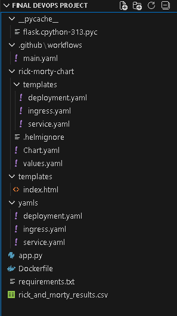
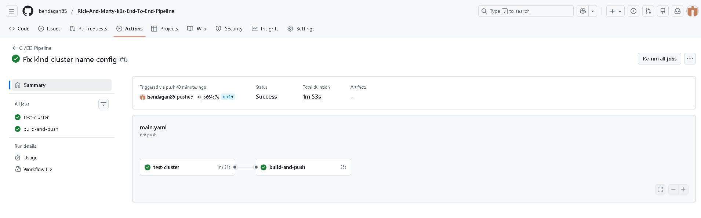
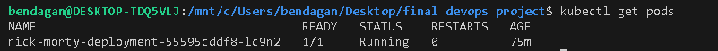
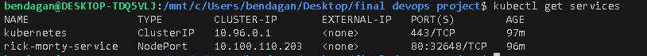
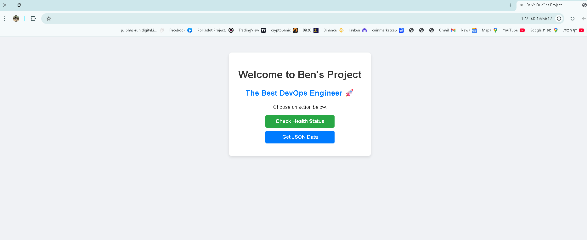
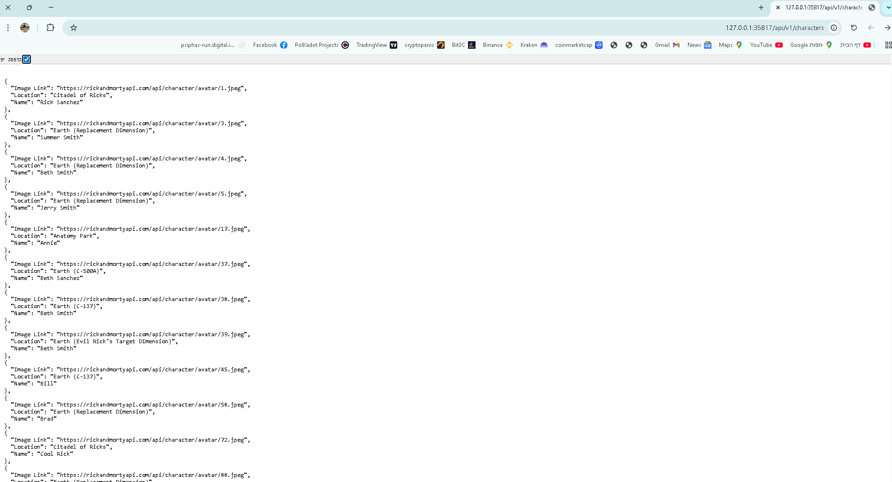

# 🛸 Rick and Morty DevOps Final Project

**Developed & Maintained by Ben**

---

## 📖 Executive Summary

This repository hosts a comprehensive **DevOps implementation** for a Python Flask microservice. The project demonstrates a "Cloud-Native First" methodology, integrating containerization, orchestration, and fully automated CI/CD pipelines.

The application interacts with the Rick and Morty API to filter and process character data (specifically searching for 'Human' characters from 'Earth' who are 'Alive') and exposes this data via RESTful endpoints.

### 🛠️ Technology Stack

| Component | Technology | Description |
| :--- | :--- | :--- |
| **Backend** | Python 3.9 / Flask | Lightweight web application framework. |
| **Containerization** | Docker | Optimized multi-stage builds. |
| **Orchestration** | Kubernetes (K8s) | Tested on Minikube & Kind. |
| **Package Manager** | Helm v3 | Custom chart for scalable deployment. |
| **CI/CD** | GitHub Actions | End-to-end automation with testing gates. |
| **Registry** | Docker Hub | Public image hosting. |

---

## ⚙️ Architecture & CI/CD Pipeline

The project utilizes a robust **GitOps** workflow. Every commit to the `main` branch triggers a two-stage pipeline to ensure zero-downtime and code integrity.

### The Automated Workflow:

1.  **Build & Test (CI):**
    * A temporary **Kind (Kubernetes in Docker)** cluster is spun up strictly for testing.
    * The Docker image is built and loaded into the cluster.
    * The Helm Chart is deployed to simulate a production environment.
    * **Health Check:** The pipeline verifies that all Pods reach a `Running` state.
2.  **Release & Deploy (CD):**
    * Upon successful testing, the image is tagged and pushed to **Docker Hub**.
    * The infrastructure is updated to pull the latest version.

---

## 🚀 Installation & Usage

### Prerequisites
* Docker & Minikube
* Kubectl & Helm

### Option 1: Deployment via Helm (Recommended)
This method uses the custom Helm chart created for this project.

```bash
# 1. Install the Chart
helm upgrade --install rick-morty-app ./rick-morty-chart

# 2. Verify Pod Status
kubectl rollout status deployment/rick-morty-deployment

# 3. Access the Application
minikube service rick-morty-service
```

### Option 2: Run via Docker (Standalone)
```bash
docker run -p 8080:8080 bendagan/rick-and-morty-app:latest
```

### Option 3: Vanilla Kubernetes Manifests
For environments without Helm, raw YAML files are provided:
```bash
kubectl apply -f yamls/manifest.yaml
```

---

## 🔌 API Documentation

| Method | Endpoint | Description |
| :--- | :--- | :--- |
| `GET` | `/` | **Home:** Landing page with version info. |
| `GET` | `/api/v1/characters` | **Data:** Returns the filtered JSON list. |
| `GET` | `/healthcheck` | **System:** Returns 200 OK for K8s Liveness probes. |

---

## 📸 Proof of Execution

The following evidence demonstrates the successful end-to-end execution of the project requirements.

### 1. Project Structure
*Organized folder structure including Charts, Templates, and Workflows.*


### 2. CI/CD Pipeline Success (GitHub Actions)
*Evidence of the pipeline passing the `test-cluster` stage and the `build-and-push` stage.*


### 3. Docker Hub Registry
*Verification of the image being successfully pushed to the public registry.*


### 4. Kubernetes Infrastructure
*Terminal output showing Pods, Services, and Ingress running successfully in Minikube.*



### 5. Application Homepage
*Browser view of the deployed application.*


### 6. JSON Data Response
*Browser view of the processed API data.*
